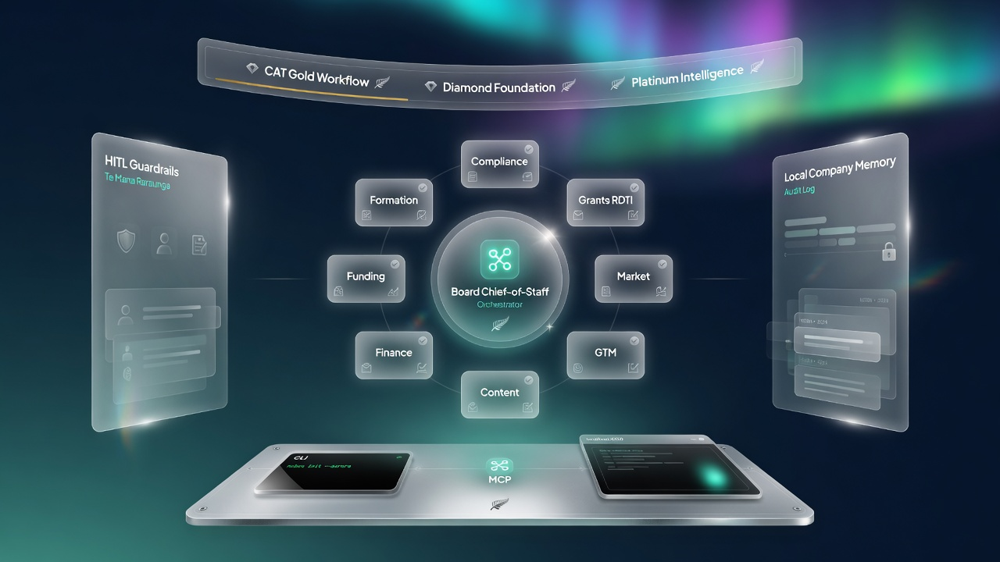

# NZ Start-Up in a Box

[](./ABOUT.md)
[](./ABOUT.md)
[](./ABOUT.md)
[](./ABOUT.md)
[](./ABOUT.md)

[-b91c1c?style=flat-square)](./docs/DUAL_LICENCE.md)
[](./docs/DUAL_LICENCE.md)
[](./COMPLIANCE.md)
[](./compliance/te-mana-raraunga.md)
[](./docs/STANDARDS.md)
[](./CHANGELOG.md)
[](./ABOUT.md)

[](https://x.ai)
[](https://claude.ai)
[](https://claude.ai)
[](https://deepmind.google/technologies/gemini/)
[](https://github.com/fivepanelhat/Aether)

**Local founder OS + white-label EDA kit for Aotearoa New Zealand**  
Formation through funding · hard legal ceilings · CAT Gold / Diamond / Platinum · **Coastal Alpine Tech pre-seed**  
**Hybrid:** edge (RPi 5 + Hailo target) + multi-model fleet · agents draft/prepare · humans file/send/pay/sign

> **Investor one-liner:** Coastal Alpine Tech is building the sovereign hybrid edge-AI stack for Aotearoa’s primary industries and founders — local-first RPi 5 + Hailo nodes, multi-model fleets (Grok/Claude/Gemini), Te Mana Raraunga data sovereignty, and white-label EDA tools — actively seeking collaboration with **Venture Taranaki**, **startups.com investors**, and the **Kotahitanga Investment Fund** to scale intergenerational Māori and regional economic outcomes.

> **One download.** Skills + NZ knowledge + templates + HITL + localhost console.  
> **IP:** Dual licence (proprietary default + commercial track) · protected under **NZ copyright law**.  
> **Whenua:** Taranaki · Wayne Roberts · whānau with **six generations in agriculture**.  
> **Not open source.** Production / white-label requires a commercial licence.  
> **Collaboration:** Open to Venture Taranaki, startups.com investors, and Kotahitanga Investment Fund (cultural HITL for formal approaches).

## Coastal Alpine Tech (pre-seed)

| | |
|--|--|
| **Company** | Coastal Alpine Tech Limited |
| **Stage** | Pre-seed |
| **R&D started** | 8 August 2025 |
| **Founding date** | 8 August 2026 |
| **Region** | Taranaki, Aotearoa New Zealand |
| **Founding context** | Wayne Roberts · Taranaki whānau · 6 generations in agriculture |
| **Māori development** | Te Mana Raraunga–aligned · no cultural extraction · HITL for cultural content |

Full story: [`ABOUT.md`](./ABOUT.md) · Dual licence: [`docs/DUAL_LICENCE.md`](./docs/DUAL_LICENCE.md)

## What you get

A **small orchestrator + skills-heavy specialist fleet** (not 30 fake “autonomous employees”):

| # | Digital employee | Role | Autonomy ceiling |
|---|------------------|------|------------------|
| 1 | Formation Officer | Name, constitution pack, IRD/GST prep, NZBN | Prepares; founder files via RealMe |
| 2 | Compliance Registrar | Annual returns, Privacy Act, H&S, employment checklists | Drafts + calendar; never self-certifies |
| 3 | Grants & RDTI Clerk | Grant radar, eligibility, R&D activity logging | High autonomy on logs; human submits apps |
| 4 | Market Validator | Sizing, comps, interview guides | Research autonomous; sources + confidence |
| 5 | GTM / Pipeline Rep | ICP, outreach drafts, CRM hygiene, proposals | **Sends nothing** without approval (UEM Act) |
| 6 | Content & Comms Officer | One-asset-five-outputs engine | Schedules only pre-approved content |
| 7 | Finance Clerk | Bookkeeping triage, GST prep, runway alerts | Never moves money; not a tax agent |
| 8 | Funding Analyst | Investor targeting, data room, SAFE comparison | Prep only; FMCA advice boundary |
| 9 | Legal Document Assistant | NDA, pilot, ToS, employment drafts | Watermarked “not legal advice” |
| 10 | Board / Chief-of-Staff | Weekly ops review, routing, company memory | Escalates; never decides |

Plus **`agent-hardening`** and **`cat-architectural-standards`** governance skills.

The **NZ moat** is jurisdiction depth (Companies Office, IRD, RDTI, regional grants, Te Mana Raraunga) — not agent novelty.

## Dual licence (IP protection)

| Track | File | Use |
|-------|------|-----|
| **A — Default** | [`LICENSE`](./LICENSE) | Proprietary evaluation only |
| **B — Commercial** | [`LICENSE-COMMERCIAL.md`](./LICENSE-COMMERCIAL.md) | Production · white-label · cohort (by agreement) |

Copyright is automatic under the **Copyright Act 1994 (NZ)**. Dual licence lets Coastal Alpine Tech keep ownership while selling commercial rights at pre-seed. **Not legal advice** — see `docs/DUAL_LICENCE.md`.

## Standards (mandatory)

| Tier | Name | Meaning |
|------|------|---------|
| **Gold** | Workflow-native design | Fleet maps the real NZ founder lifecycle |
| **Diamond** | Enterprise-grade foundation | CI, hardening, compliance gate, sandbox |
| **Platinum** | Self-improving intelligence | Memory + RDTI flywheel + weekly board |

Load `agent-hardening` then `cat-architectural-standards` before material work.

## Hard boundaries

Agents may **inform, draft, prepare, monitor, and remind**.  
Humans must **advise, sign, file, send, and pay**.

- No legal advice · no regulated financial advice · no tax-agent acts  
- No autonomous cold email (UEM Act 2007)  
- No Companies Office / IRD filing except founder-authenticated action  
- Privacy Act 2020 + Te Mana Raraunga for data  
- Visible audit trail for agent actions  

## Architecture

See **[docs/ARCHITECTURE_DETAILED.md](docs/ARCHITECTURE_DETAILED.md)**.



## Quick start (Windows)

```powershell
git clone https://github.com/fivepanelhat/NZ-Start-Up.git
cd NZ-Start-Up
powershell -ExecutionPolicy Bypass -File .\install.ps1
python -m nz_startup doctor
python -m nz_startup compliance check
python -m nz_startup onboard my-startup --legal-name "My Labs Limited"
python -m nz_startup console --port 8765 --open
```

### CLI cheat sheet

```powershell
python -m nz_startup harden status
python -m nz_startup compliance check
python -m nz_startup demo run --partner "Venture Taranaki"
python -m nz_startup board pack demo-eda
python -m nz_startup pilot offer my-startup --customer "Named Account" --fee 1500
python -m nz_startup cohort pack vt-powerup
python -m nz_startup smoke
```

## Repository layout

```text
skills/                 # Digital employees + agent-hardening + CAT
nz_startup/             # CLI, MCP, guardrails, compliance gate, console
compliance/             # HITL, Privacy Act, Te Mana Raraunga, licence posture
docs/                   # Architecture, dual licence, demos, white-label
memory/                 # Schema + example (live companies gitignored)
templates/              # Checklists and commercial outlines
assets/                 # Architecture art
ABOUT.md                # Coastal Alpine Tech pre-seed story
```

## Pricing posture (indicative)

| Tier | Indicative |
|------|------------|
| Founder | ~NZ$49/mo |
| Active | ~NZ$149/mo |
| Accelerator cohort | ~NZ$399 seat |
| White-label | per-seat / per-cohort |

## Disclaimer

**Not legal, financial, tax, or cultural advice.** Confirm NZ statutes and dual-licence commercial terms with qualified professionals. Templates and agent drafts are educational / preparatory only.

## Licence

**Dual licence (proprietary default + commercial track).**  
See `LICENSE`, `LICENSE-COMMERCIAL.md`, `NOTICE`, and `docs/DUAL_LICENCE.md`.  
**© 2025–2026 Coastal Alpine Tech Limited — Pre-seed · Taranaki.**
