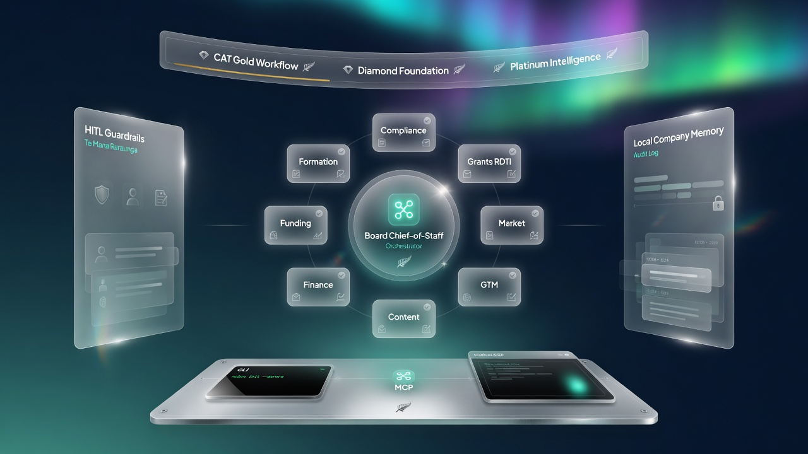

# NZ Start-Up

**Founder operating system for Aotearoa New Zealand** — formation through early funding, with hard legal ceilings and Human-in-the-Loop governance.

**Status:** Pre-seed · [REALITY.md](./REALITY.md) · [EDA demo kit](./docs/EDA_DEMO_KIT.md) · [Market](./docs/MARKET.md) · [Investor dossier](./docs/INVESTOR_RD_AND_MARKET_REFERENCE.md)

<!-- BEGIN CAT_CONGRUENCE_SNIPPET -->
## Coastal Alpine Tech portfolio

[](https://github.com/fivepanelhat/fivepanelhat)
[](https://github.com/fivepanelhat/fivepanelhat)
[](./.github/agent-fleet/AGENTS.md)
[](https://github.com/fivepanelhat/fivepanelhat)

**Part of the [Kiwi Edge AI Stack](https://github.com/fivepanelhat/fivepanelhat)** | Founder OS: [NZ-Start-Up](https://github.com/fivepanelhat/NZ-Start-Up) | Agent policy: [`.github/agent-fleet/`](./.github/agent-fleet/)

> Sovereign hybrid edge AI for NZ farms and founders — local-first + multi-model, Te Mana Raraunga aligned. Open to collaboration with Venture Taranaki, startups.com investors, and Kotahitanga Investment Fund (HITL and cultural advisory for formal approaches).

**Agents inform, draft, prepare, monitor, and remind. Humans advise, sign, file, send, and pay.**  
Anti-hallucination policy: [`.github/agent-fleet/anti-hallucination.md`](./.github/agent-fleet/anti-hallucination.md) | Congruence: [`CAT_CONGRUENCE.md`](./CAT_CONGRUENCE.md)
<!-- END CAT_CONGRUENCE_SNIPPET -->

<!-- BEGIN PROBLEMS_SOLUTIONS_ECONOMY -->
## Problems we are solving

**NZ-Start-Up** is the founder operating system and EDA white-label product — local digital capacity for New Zealand company formation through early funding discipline.

1. **Founder time tax** — Formation, IRD/GST, annual returns, and grants are fragmented across PDFs and portals.
2. **EDA capacity limits** — Regional economic development agencies cannot scale specialist advice linearly with founder volume.
3. **Weak R&D evidence** — RDTI and grants fail without contemporaneous activity logs.
4. **Legal overreach by AI** — Unconstrained agents invent filings; New Zealand needs hard ceilings (UEM, tax, legal).
5. **Capital-city bias** — Many tools assume Auckland SaaS defaults, not Taranaki and regional founder realities.

## Solution we have built

| Built capability | What it does |
| :--- | :--- |
| **Skills fleet** | Formation, compliance, grants/RDTI, market, GTM — draft/prepare only |
| **NZ knowledge + templates** | Jurisdiction-native memory and checklists |
| **HITL console** | Localhost founder OS with default-deny autonomy |
| **EDA white-label path** | Cohort packs and partner-oriented reporting design |
| **Investor / market docs** | Market fit, employment pathways, seed packs in `docs/` |

**Autonomy ceiling:** agents draft and prepare; founders and advisors **file, send, pay, and sign**.

### Local (Taranaki) and national (Aotearoa) economic benefits

Coastal Alpine Tech is a **pre-seed** company engineering in **New Plymouth, Taranaki**, with field context in regional primary industries. Benefits are framed as **pathways**, not guaranteed job numbers.

#### Local / regional (Taranaki and rural NZ)

| Pathway | What it creates |
| :--- | :--- |
| **R&D and product HQ** | Engineering, product, and IP ownership in region — counterweight to capital-city-only tech |
| **Field install and support** | Edge nodes, sensors, and pilot support need local technicians and partners |
| **EDA leverage** | Tools that help Venture Taranaki-class programmes onboard more founders without linear staff growth |
| **Contractor network** | Legal, cultural advisory, hardware, and pilot ops spend that stays in NZ |

#### National economy and employment

| Pathway | What it creates |
| :--- | :--- |
| **Primary sector competitiveness** | Better yield, compliance, and biosecurity decisions support NZ’s export food economy |
| **Onshore data value** | Farm, whānau, and SME operational data stays under NZ custody (Privacy Act + Te Mana Raraunga) |
| **Founder formation** | Faster, cleaner company setup and RDTI-ready logging keeps more early companies investable **in NZ** |
| **Digital capability outside main centres** | Edge AI skills transferable across regions |
| **Quality of work** | Human-in-the-loop design preserves skilled human roles in advice, compliance, and care |

#### How this product contributes

See **Solution we have built** above. Cross-portfolio map: [Kiwi Edge AI Stack](https://github.com/fivepanelhat/fivepanelhat) | employment detail: [NZ-Start-Up investor pack](https://github.com/fivepanelhat/NZ-Start-Up/blob/main/docs/INVESTOR_RD_AND_MARKET_REFERENCE.md).

#### Founder / EDA employment detail

| Pathway | Effect |
| :--- | :--- |
| **More regional companies formed correctly** | Higher quality pipeline for Venture Taranaki and peers |
| **RDTI-ready logging** | Keeps R&D activity onshore and fundable |
| **EDA staff leverage** | White-label kit scales advice without linear headcount |
| **Local professional spend** | Lawyers, accountants, cultural advisors still required — product prepares packs, does not replace them |

Full dossier: [`docs/INVESTOR_RD_AND_MARKET_REFERENCE.md`](./docs/INVESTOR_RD_AND_MARKET_REFERENCE.md) | market: [`docs/MARKET.md`](./docs/MARKET.md)
<!-- END PROBLEMS_SOLUTIONS_ECONOMY -->

[](./ABOUT.md)
[](./ABOUT.md)
[](./ABOUT.md)
[](./ABOUT.md)
[](./ABOUT.md)

[-b91c1c?style=flat-square)](./docs/DUAL_LICENCE.md)
[](./docs/DUAL_LICENCE.md)
[](./COMPLIANCE.md)
[](./compliance/te-mana-raraunga.md)
[](./docs/STANDARDS.md)
[](./CHANGELOG.md)
[](./ABOUT.md)

**NZ Start-Up** is a local-first founder operating system and white-label kit for regional economic development agencies (EDAs). It covers company formation through early funding discipline under New Zealand law, with explicit autonomy ceilings: agents draft and prepare; founders and advisors file, send, pay, and sign.

| | |
|--|--|
| **Scope** | Formation · compliance · grants / RDTI · market · GTM · legal drafts · board rhythm |
| **Governance** | Hard HITL · Privacy Act 2020 · Te Mana Raraunga · UEM Act aware |
| **Standards** | CAT Gold / Diamond / Platinum design targets |
| **Licence** | Dual track — proprietary evaluation default; commercial / white-label by agreement |
| **Built by** | Coastal Alpine Tech Limited (pre-seed) · Taranaki, Aotearoa New Zealand |

> **One-liner:** Jurisdiction-native founder OS for New Zealand — skills, templates, and a localhost console that prepare work under hard legal ceilings, without replacing lawyers, accountants, or the founder’s own filing authority.

## Coastal Alpine Tech (pre-seed)

| | |
|--|--|
| **Company** | Coastal Alpine Tech Limited |
| **Stage** | Pre-seed |
| **R&D started** | 8 August 2025 |
| **Founding date** | 8 August 2026 |
| **Region** | Taranaki, Aotearoa New Zealand |
| **Founding context** | Wayne Roberts · Taranaki · six generations in agriculture |
| **Māori development** | Te Mana Raraunga aligned · no cultural extraction · HITL for cultural content |

Full story: [`ABOUT.md`](./ABOUT.md) | Dual licence: [`docs/DUAL_LICENCE.md`](./docs/DUAL_LICENCE.md)  
**Investor R&D + market dossier:** [`docs/INVESTOR_RD_AND_MARKET_REFERENCE.md`](./docs/INVESTOR_RD_AND_MARKET_REFERENCE.md)  
**Market fit matrix:** [`docs/MARKET_FIT_MATRIX.md`](./docs/MARKET_FIT_MATRIX.md) | **Portfolio:** [`docs/PORTFOLIO_MARKET_FIT.md`](./docs/PORTFOLIO_MARKET_FIT.md) | **Seed pack:** [`docs/SEED_INVESTOR_PACK.md`](./docs/SEED_INVESTOR_PACK.md)  
**Market opportunity:** [`docs/MARKET.md`](./docs/MARKET.md)

## What you get

A **small orchestrator + skills-heavy specialist fleet** (not unconstrained “autonomous employees”):

| # | Digital employee | Role | Autonomy ceiling |
| --- | ------------------ | ------ | ------------------ |
| 1 | Formation Officer | Name, constitution pack, IRD/GST prep, NZBN | Prepares; founder files via RealMe |
| 2 | Compliance Registrar | Annual returns, Privacy Act, H&S, employment checklists | Drafts + calendar; never self-certifies |
| 3 | Grants & RDTI Clerk | Grant radar, eligibility, R&D activity logging | High autonomy on logs; human submits apps |
| 4 | Market Validator | Sizing, comps, interview guides | Research autonomous; sources + confidence |
| 5 | GTM / Pipeline Rep | ICP, outreach drafts, CRM hygiene, proposals | **Sends nothing** without approval (UEM Act) |
| 6 | Content & Comms Officer | Brand voice, one-pagers, press, founder narrative | Schedules only pre-approved content |
| 7 | Finance Clerk | Bookkeeping triage, GST prep, runway alerts | Never moves money; not a tax agent |
| 8 | Funding Analyst | Investor targeting, data room, SAFE comparison | Prep only; FMCA advice boundary |
| 9 | Legal Document Assistant | NDA, pilot, ToS, employment drafts | Watermarked “not legal advice” |
| 10 | Board / Chief-of-Staff | Weekly ops review, routing, company memory | Escalates; never decides |

Plus **`agent-hardening`** and **`cat-architectural-standards`** governance skills.

The **NZ moat** is jurisdiction depth (Companies Office, IRD, RDTI, regional grants, Te Mana Raraunga) — not agent novelty.

## Dual licence (IP protection)

| Track | File | Use |
| ------- | ------ | ----- |
| **A Default** | [`LICENSE`](./LICENSE) | Proprietary evaluation only |
| **B Commercial** | [`LICENSE-COMMERCIAL.md`](./LICENSE-COMMERCIAL.md) | Production · white-label · cohort (by agreement) |

Copyright is automatic under the **Copyright Act 1994 (NZ)**. Dual licence lets Coastal Alpine Tech keep ownership while selling commercial rights at pre-seed. **Not legal advice** — see `docs/DUAL_LICENCE.md`.

## Standards (mandatory)

| Tier | Name | Meaning |
| ------ | ------ | --------- |
| **Gold** | Workflow-native design | Fleet maps the real NZ founder lifecycle |
| **Diamond** | Enterprise-grade foundation | CI, hardening, compliance gate, sandbox |
| **Platinum** | Self-improving intelligence | Memory + RDTI flywheel + weekly board |

Load `agent-hardening` then `cat-architectural-standards` before material work.

## Hard boundaries

Agents may **inform, draft, prepare, monitor, and remind**.  
Humans must **advise, sign, file, send, and pay**.

- No legal advice · no regulated financial advice · no tax-agent acts
- No autonomous cold email (UEM Act 2007)
- No Companies Office / IRD filing except founder-authenticated action
- Privacy Act 2020 + Te Mana Raraunga for data
- Visible audit trail for agent actions

## Architecture

See **[docs/ARCHITECTURE_DETAILED.md](docs/ARCHITECTURE_DETAILED.md)**.



## Quick start (Windows)

```powershell
git clone https://github.com/fivepanelhat/NZ-Start-Up.git
cd NZ-Start-Up
powershell -ExecutionPolicy Bypass -File .\install.ps1
python -m nz_startup doctor
python -m nz_startup compliance check
python -m nz_startup onboard my-startup --legal-name "My Labs Limited"
python -m nz_startup console --port 8765 --open
```

### CLI cheat sheet

```powershell
python -m nz_startup harden status
python -m nz_startup compliance check
python -m nz_startup demo run --partner "Venture Taranaki"
python -m nz_startup board pack demo-eda
python -m nz_startup pilot offer my-startup --customer "Named Account" --fee 1500
python -m nz_startup cohort pack vt-powerup
python -m nz_startup smoke
```

## Repository layout

```text
skills/          # Digital employees + agent-hardening + CAT
nz_startup/      # CLI, MCP, guardrails, compliance gate, console
compliance/      # HITL, Privacy Act, Te Mana Raraunga, licence posture
docs/            # Architecture, dual licence, demos, white-label
memory/          # Schema + example (live companies gitignored)
templates/       # Checklists and commercial outlines
assets/          # Architecture art
ABOUT.md         # Coastal Alpine Tech pre-seed story
```

## Pricing posture (indicative)

| Tier | Indicative |
| ------ | ------------ |
| Founder | ~NZ$49/mo |
| Active | ~NZ$149/mo |
| Accelerator cohort | ~NZ$399 seat |
| White-label | per-seat / per-cohort |

## Disclaimer

**Not legal, financial, tax, or cultural advice.** Confirm NZ statutes and dual-licence commercial terms with qualified professionals. Templates and agent drafts are educational / preparatory only.

## Licence

**Dual licence (proprietary default + commercial track).**  
See `LICENSE`, `LICENSE-COMMERCIAL.md`, `NOTICE`, and `docs/DUAL_LICENCE.md`.  
© 2025–2026 Coastal Alpine Tech Limited · Pre-seed · Taranaki.
