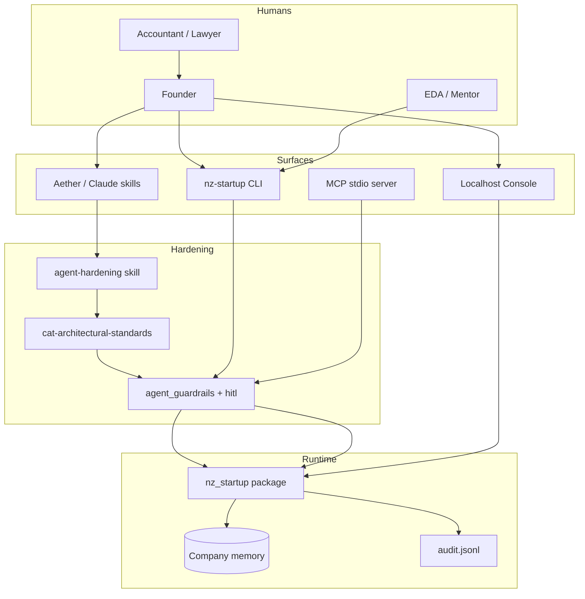
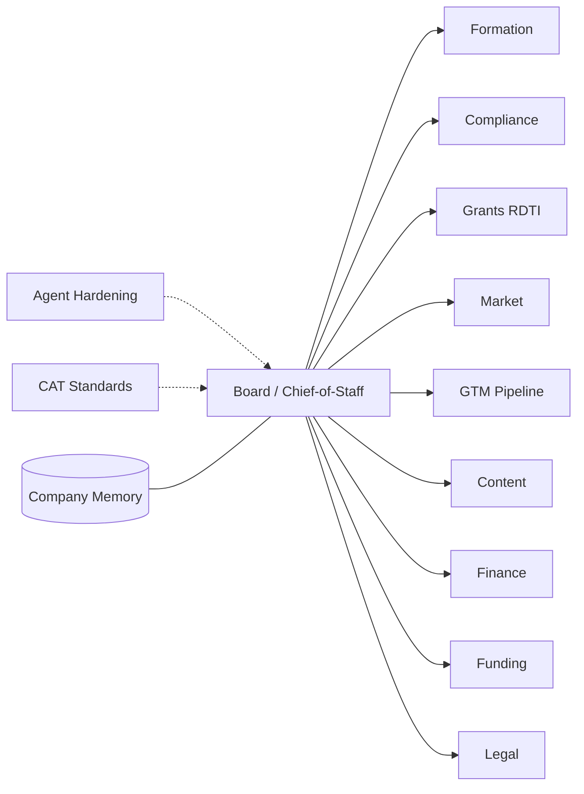
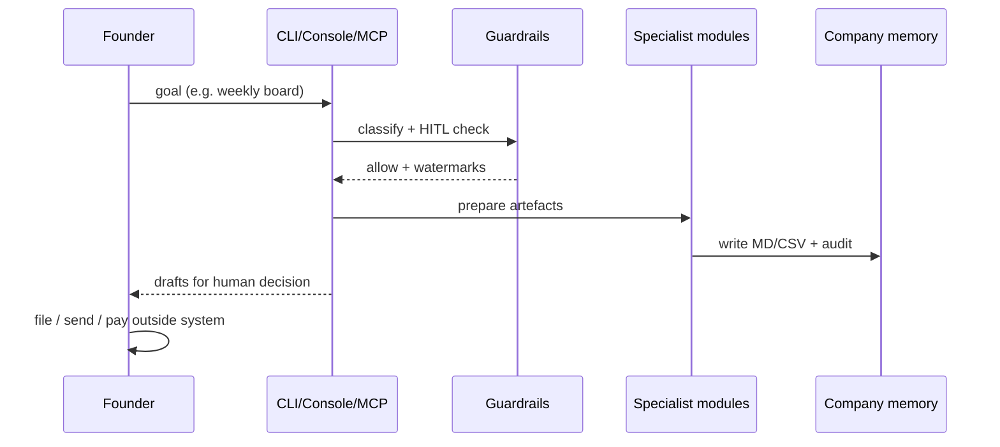

# NZ Start-Up in a Box — Detailed Architecture

**Product version:** 1.2.0  
**Standards:** CAT Gold · Diamond · Platinum (Aether-aligned)  
**Owner:** Coastal Alpine Tech Limited · Taranaki · Aotearoa New Zealand


*Hero visual: glassmorphism fleet map — Board orchestrator, specialist ring, CAT tiers, HITL, local memory, CLI/MCP/console surfaces.*

---

## 1. Purpose

Deliver a **local-first NZ founder operating system**: skills-heavy specialists under a small orchestrator, with **jurisdiction depth** (Companies Office, IRD, RDTI, EDAs, Privacy Act, Te Mana Raraunga) and **hard autonomy ceilings**.

Not a multi-tenant SaaS agent farm. Not legal/financial/tax advice automation.

---

## 2. Design principles

| Principle | Implementation |
|-----------|----------------|
| Gold — workflow-native | Fleet maps NZ founder lifecycle end-to-end |
| Diamond — foundation | CI, doctor/smoke, sandbox, secrets refusal, proprietary licence |
| Platinum — intelligence | Company memory flywheel, RDTI logs, weekly board synthesis |
| HITL | Agents draft/prepare; humans file/send/pay/sign |
| Local-first | `memory/companies/*` on founder machine |
| NZ moat | Knowledge + templates + compliance, not commodity agent tech |

---

## 3. System context



---

## 4. Logical architecture

### 4.1 Layers

| Layer | Components |
|-------|------------|
| **Presentation** | Founder Console (127.0.0.1), CLI UX, skill prompts |
| **Orchestration** | `board-chief-of-staff`, `nz-startup-fleet` |
| **Governance** | `agent-hardening`, `cat-architectural-standards`, COMPLIANCE |
| **Specialists** | 10 digital employees (formation → legal) |
| **Domain runtime** | pipeline, calendar, grants, rdti, bank, gst, invoices, xero, pilot, cohort |
| **Persistence** | Markdown/CSV/JSONL under `memory/companies/<id>/` |
| **Packaging** | board-packs, handoff, white-label, pilot zips |

### 4.2 Fleet topology



### 4.3 Autonomy control plane

```text
Action request
    │
    ├─ hitl.check_action()          → block forbidden fragments
    ├─ agent_guardrails.classify    → risk tier + watermarks
    ├─ secret/PII scan on writes
    ├─ path sandbox under company memory
    └─ audit.jsonl append
```

**Forbidden autonomy:** file, send, pay, sign, submit, claim, bypass HITL, mass mail, exfiltrate.

---

## 5. Data architecture

### 5.1 Company memory layout

```text
memory/companies/<id>/
  profile.md decisions.md runway.md
  pipeline.csv|md  calendar.csv|md  grants-tracker.csv|md
  rdti-log.csv  audit.jsonl
  weekly/  status/  demo/  onboard/
  finance/
    bank-feed.csv  bank-imports/  xero-snapshot.*  gst/  invoices/
  commercial/pilots/
  handoff/  board-packs/  exports/
```

### 5.2 Data flow (Gold unbroken chain)



### 5.3 Sensitivity classes

| Class | Examples | Policy |
|-------|----------|--------|
| Public/ops | pipeline stages, public grant names | OK in memory |
| Confidential business | runway notes, pilot fees | local only; no commit of live tenants |
| Secrets | API keys, PEMs, tokens | **write refused** |
| Regulated drafts | legal, GST, outreach | watermark + HITL |

---

## 6. Runtime components

| Module | Role |
|--------|------|
| `hitl.py` | Forbidden tools + action fragment blocks |
| `agent_guardrails.py` | Risk, secrets, sandbox, skill policy text |
| `memory.py` | Sandboxed company IO |
| `pipeline/calendar/grants/rdti` | Ops trackers |
| `bank_feed/gst_worksheet/invoice_triage/xero_readonly` | Finance assist |
| `handoff/board_pack/pilot_offer/cohort/demo` | Packaging & GTM |
| `status/smoke/doctor/console` | Operability & UI |
| `mcp_server.py` | HITL-safe tool surface (~47 tools) |

---

## 7. Security architecture

### 7.1 Threat model (summary)

| Threat | Mitigation |
|--------|------------|
| Agent sends cold email | No send tools; UEM watermark; HITL |
| Agent files IRD/Companies Office | No filing tools; formation prep only |
| Secret leakage to git | Secret scanners on write; .gitignore live memory |
| Path traversal | `resolve_sandboxed_path` |
| Console exposed on LAN | Bind refused except 127.0.0.1/localhost |
| Over-claiming compliance | Watermarks; “not a certificate” language |
| Cultural extraction | High cultural_sensitivity; Te Mana Raraunga skill/docs |

### 7.2 Trust boundaries

1. **Human laptop** — full trust for local memory  
2. **LLM provider** (if used) — minimise PII in prompts  
3. **Optional Xero API** — read-only tokens in env only  
4. **Partner zip packs** — no seat PII in white-label distribution  

---

## 8. Deployment views

### 8.1 Solo founder (default)

```text
Windows/macOS/Linux
  └─ Python package nz_startup
       ├─ skills/ → ~/.aether/skills
       ├─ memory/companies/<id>
       ├─ console :8765 (localhost)
       └─ optional MCP stdio
```

### 8.2 EDA white-label

```text
Partner ops machine
  ├─ cohort init / add-seat / report / pack
  ├─ founders run onboard on their machines
  └─ mentor receives board-pack zip (manual)
```

### 8.3 Explicit non-goals (v1.x)

- Multi-tenant hosted control plane  
- Autonomous always-on digital employees  
- Tax agent or authorised Companies Office agent behaviour  

---

## 9. Standards mapping

| CAT tier | Where it lives |
|---------|----------------|
| **Gold** | `docs/FLEET.md`, lifecycle skills, templates, company memory chain |
| **Diamond** | CI, doctor/smoke, hardening, sandbox, LICENSE/SECURITY |
| **Platinum** | Weekly board synthesis, RDTI capture, status scoring, flywheel docs |

---

## 10. Extension points

1. New specialist skill under `skills/<name>/SKILL.md` + HITL matrix row  
2. New CLI subcommand calling sandboxed modules  
3. MCP tool only if it cannot send/file/pay  
4. Console page only for read + local prepare actions  

---

## 11. Related documents

| Doc | Content |
|-----|---------|
| `docs/ARCHITECTURE.md` | Short system map |
| `docs/AGENT_HARDENING.md` | Hardening guide |
| `docs/FLEET.md` | Digital employee roster |
| `docs/CONSOLE.md` | Local UI |
| `docs/WHITE_LABEL.md` | Cohort packaging |
| `COMPLIANCE.md` | Legal/cultural framework |
| `RELEASE.md` | Product release notes |

---

## 12. Version history (architecture)

| Version | Architecture milestone |
|---------|------------------------|
| 0.1–0.2 | Skills pack + CLI/MCP core |
| 0.3–0.6 | Ops + finance + handoff |
| 0.7–0.9 | White-label + commercial pilot kits |
| 1.0–1.1 | Console + desktop-lite |
| **1.2** | **Agent hardening plane + detailed architecture** |
